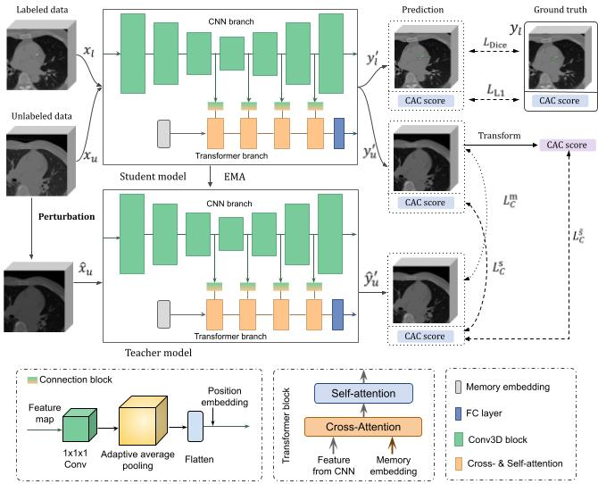

## 🧠 Overview

This repository provides the PyTorch implementation of S2CAC, a novel framework that leverages both labeled and unlabeled CT data for accurate coronary artery calcium segmentation.

* **A dual-path hybrid transformer architecture** that combines 3D CNNs and Transformers to jointly predict pixel-level segmentation maps and volume-level CAC scores.
* **Scoring-driven consistency** between predicted scores and segmentation-derived scores to improve supervision from unlabeled data.
* **Negative Sample Boosting** to better exploit negative samples during training.

<p align="center">
  
</p>

---

## 📦 Environment Setup

Create environment and install all dependencies via:

```bash
conda create -n S2CAC python=3.9
conda activate S2CAC
cd S2CAC
pip install -r requirements.txt
```


---

## 📁 Dataset Preparation

Our method relies on the **nnUNet-style data preprocessing**.

### Option 1: Using nnUNet preprocessing (recommended)

1. Preprocess your dataset using [nnUNet's instructions](https://github.com/MIC-DKFZ/nnUNet).
2. Update the `data_preprocessed` field in `config.json` to point to the preprocessed data path.

### Option 2: Using your own data pipeline

If you have a custom data preprocessing or loading method, modify the function `get_dataloaders()` in `training_semi_score.py` accordingly.

---

## 🏋️‍♂️ Training

1. Adjust the hyperparameters in `config.json`.
2. Start training:

```bash
python training_semi_score.py
```

---

## 🔍 Inference

We provide pretrained model weights so that you can directly run and test the model on your own data.

### Step 1: Download weights

* [Google Drive](https://drive.google.com/file/d/1a1PPioMvbiPIjjDa__RggQ3QUioJAeBn/view?usp=drive_link)
* [Baidu Netdisk](https://pan.baidu.com/s/1De1Vdc0L-N9aHyFhdUDC5w?pwd=far4)

Place the downloaded model weights into the `model_weight/` folder.

### Step 2: Prepare test data

Put your NIfTI (`.nii.gz`) files into the `test_data/` folder.

### Step 3: Run inference

```bash
python test_from_file.py
```

Segmentations will be saved automatically.
> PS: You can adjust the patch_size parameter in the config.json file. Based on our experience, increasing the patch_size may sometimes improve the model's performance during the inference.


## 📄 Citation

If you find this work helpful, please consider citing:

```bibtex
@article{S2CACPaper2025,
  title={S2CAC: Semi-Supervised Coronary Artery Calcium Segmentation via Scoring-driven Consistency and Negative Sample Boosting},
  author={Jinkui Hao et al.},
  journal={TBD},
  year={2025}
}
```

---

## 🤝 Acknowledgements

This work partially builds upon the [nnUNet](https://github.com/MIC-DKFZ/nnUNet) project. We thank the original authors for their contribution.

---
